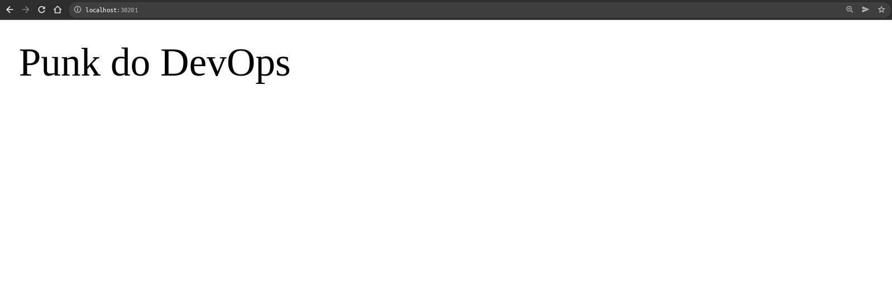

Kubernetes Experiments
======================

This is a simple exercise to deploy a simple cluster to kind using terraform

### Instructions

create cluster
```
terraform apply -target=module.kind_cluster -auto-approve && \
terraform apply -auto-approve
```

destroy clusters
```
terraform destroy -auto-approve
```

access via
```
http://localhost:30201
```



* links
[kubernetes-provider](https://learn.hashicorp.com/tutorials/terraform/kubernetes-provider)
